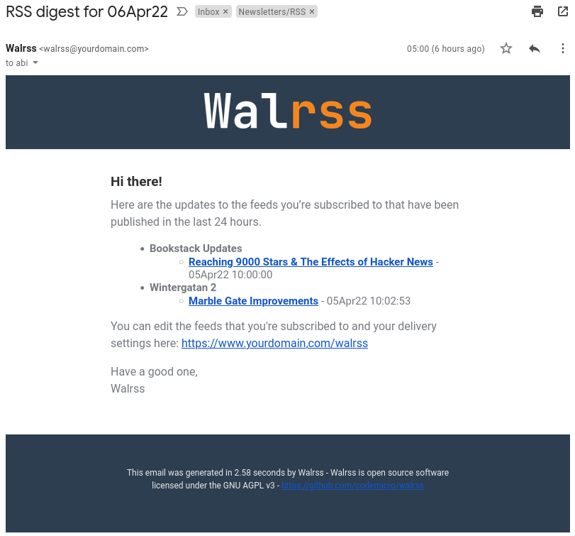

# walrss

*Email-based RSS digest generator*

[](https://github.com/codemicro/walrss/releases.atom)  [](https://goreportcard.com/report/github.com/codemicro/walrss) 

---

| Email                                                | Web UI                                   |
|------------------------------------------------------|------------------------------------------|
|  |  |

## Quickstart

### Docker

```bash
docker pull ghcr.io/codemicro/walrss:latest
mkdir walrss-data
nano walrss-data/config.yaml  # You'll have to fill in the required fields detailed below
docker run -d -v $(pwd)/walrss-data:/run -p 8080:8080 ghcr.io/codemicro/walrss:latest
```

### Build from source

You must have an up-to-date version of the Go toolchain installed. Check `go.mod` for the minimum required version.

```bash
git clone https://github.com/codemicro/walrss.git; cd walrss
go build -o walrssServer github.com/codemicro/walrss/walrss
```

```bash
mkdir walrss-data
nano walrss-data/config.yaml  # You'll have to fill in the required fields detailed below
WALRSS_DIR="./walrss-data" ./walrssServer
# now go to http://127.0.0.1:8080
```

## Config

Your `config.yaml` file lives in your data directory, which is specified by the `WALRSS_DIR` environment variable (default is `./` or `/run` if you're using Docker). Below is a list of the possible options you can set within it.

```yaml
server:
  host: 127.0.0.1
  port: 8080
  # externalURL is the URL that your instance of Walrss is accessible at
  # This is a required field
  externalURL: "http://127.0.0.1:8080"
email:
  # Defaults are not provided for any email option
  # All of the below are required fields
  password: "yourapikey"
  username: "apikey"
  host: "smtp.sendgrid.net"
  port: 587
  from: "Walrss <walrss@yourdomain.com>"
platform:
  disableRegistration: false
  disableSecureCookies: false
```

## Future features

* OPML import/export
* Feed categories
* Administrator users
* Account controls (eg password reset, change password, etc)
